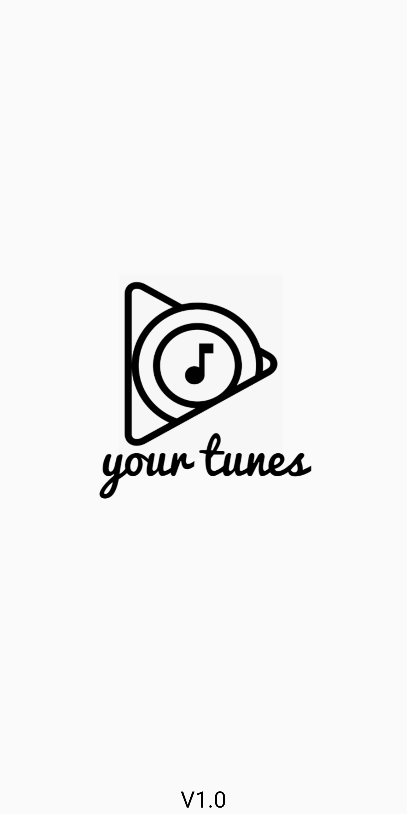
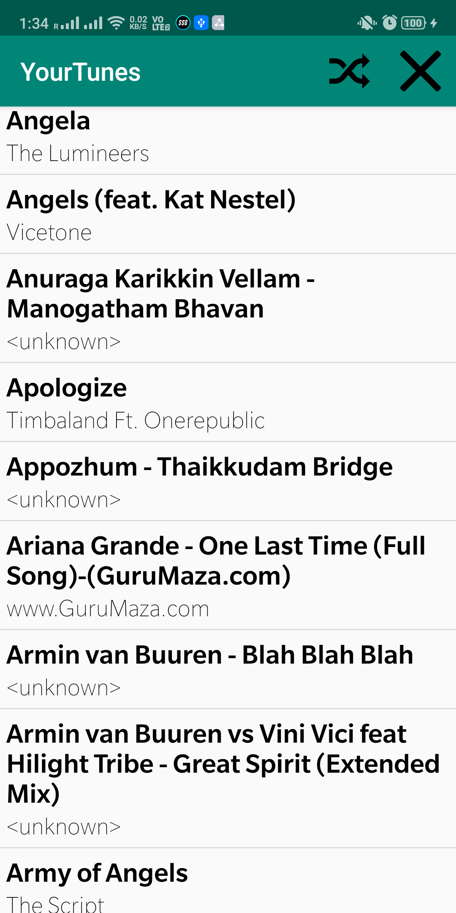
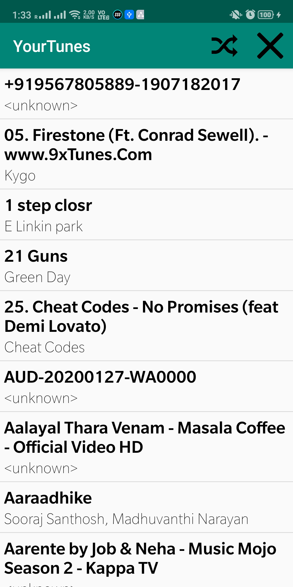

# YourTunes-Music-Player
An android music player app. This application reads the songs from the device storage. The app also has a shuffle option where the songs will be shuffled. 

Give the following permissions on the AndroidManifest.xml file:

+ android.permission.WAKE_LOCK
* android.permission.READ_EXTERNAL_STORAGE
+ android.permission.ACCESS_NOTIFICATION_POLICY
* android.permission.FOREGROUND_SERVICE

The finished app apk file is also given for reference.

# Screenshots
               

# Credits
[Create a Music Player on Android](https://code.tutsplus.com/tutorials/create-a-music-player-on-android-project-setup--mobile-22764)

[Media Player](https://developer.android.com/guide/topics/media/mediaplayer)

Fonts used : [SlateforOnePlus](https://drive.google.com/drive/u/0/folders/0B9UzADWnkrLHM0UtZWZTa0poTTA) 
